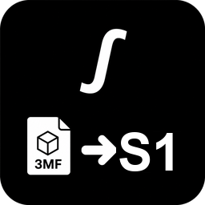
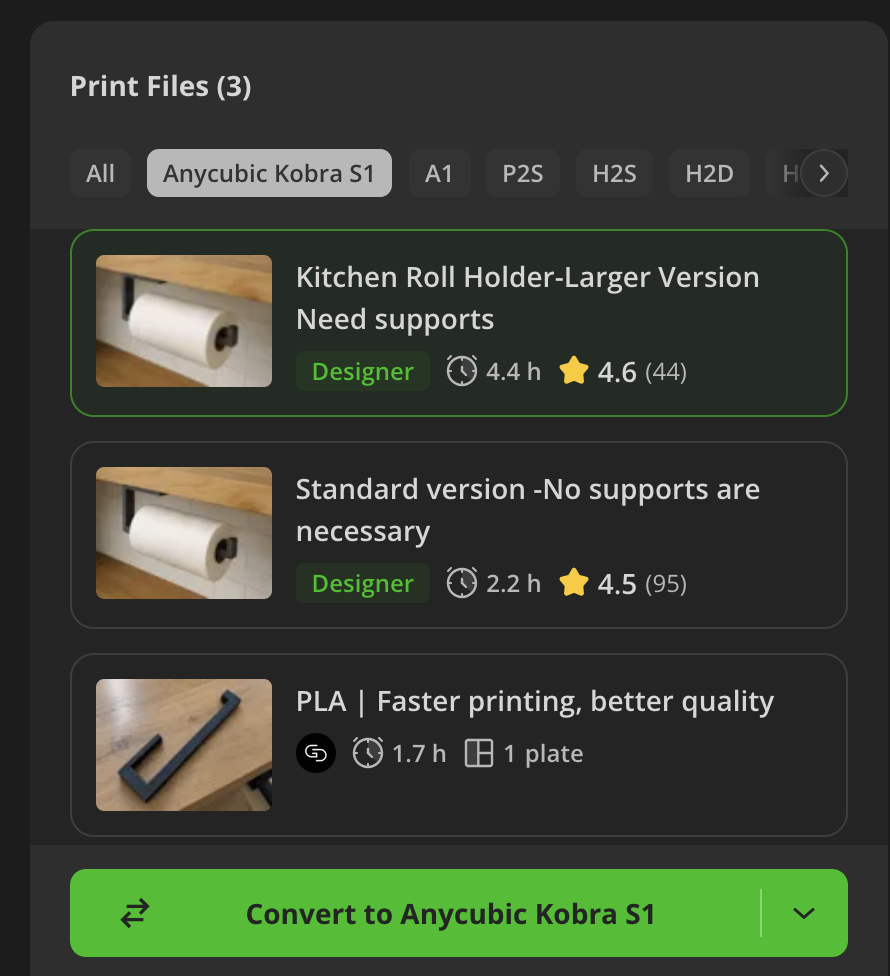
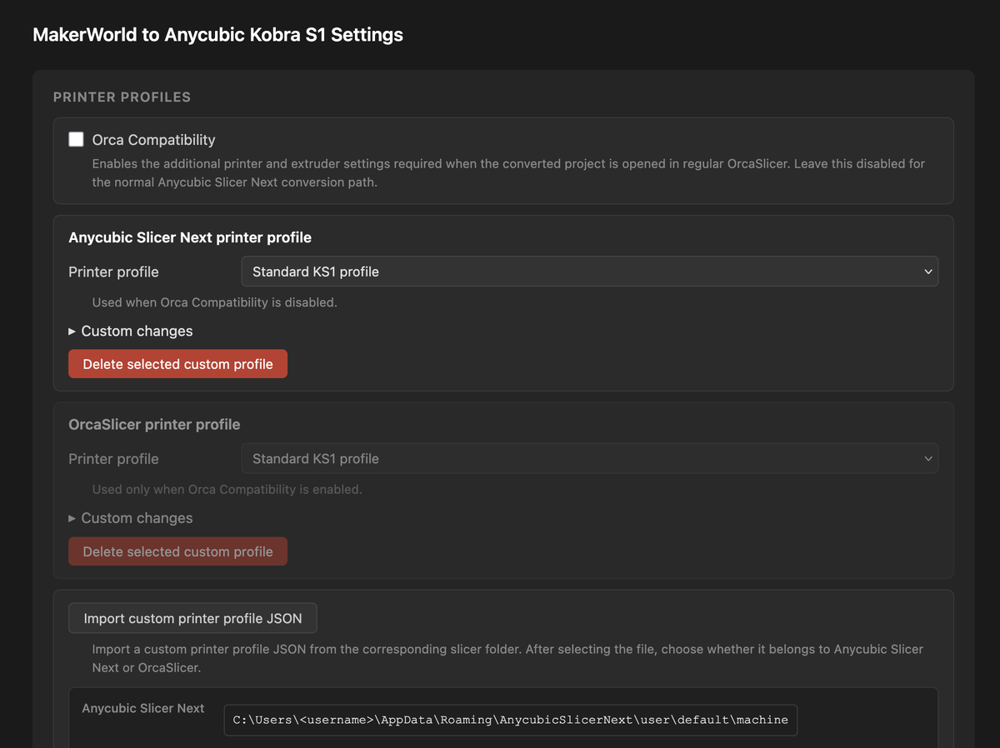
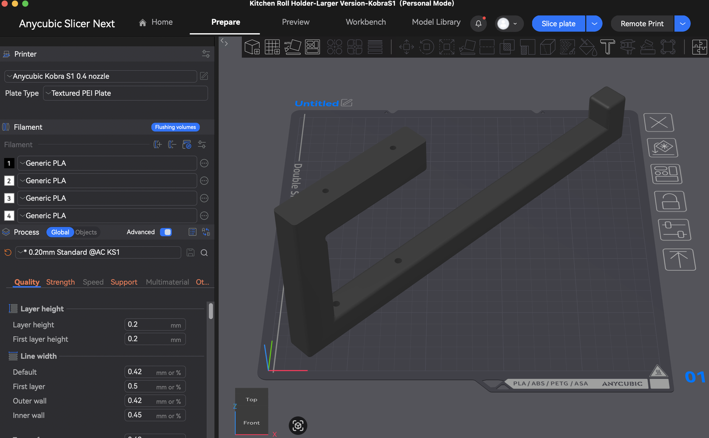

# MakerWorld to Anycubic Kobra S1

Convert MakerWorld print profiles into native Anycubic Kobra S1 projects with a single click.

MakerWorld to Anycubic Kobra S1 is a browser extension for Chrome, Chromium-based browsers and Firefox. It integrates directly into MakerWorld and adds a dedicated **"Convert to Anycubic Kobra S1"** button.


Instead of downloading a project, uploading it to an external converter and adjusting settings manually, simply click **Convert to Anycubic Kobra S1**, open the generated project in **Anycubic Slicer Next** and start printing.

The converter preserves the creator's original print settings whenever possible and automatically applies only the changes required for Anycubic Slicer Next compatibility.

All conversion happens locally inside your browser.

- No cloud services
- No external converter
- No additional software
- No account required

---

## Workflow

1. Open a MakerWorld model.
2. Select the desired print profile.
3. Select **Anycubic Kobra S1** in the printer list to replace the standard **Download 3MF** button with **Convert to Anycubic Kobra S1**.
4. Click **Convert to Anycubic Kobra S1**.
5. Open the generated `.3mf` project in Anycubic Slicer Next.
6. Review the project and start printing.

---

## MakerWorld Integration



The extension integrates directly into MakerWorld.

Converting a project is as simple as clicking **Convert to Anycubic Kobra S1**. The converted project is downloaded automatically as a `.3mf` file with the `-KobraS1` suffix and can be opened directly in Anycubic Slicer Next.

---

## Why this extension?

MakerWorld print profiles are currently distributed as Bambu Studio project files. Anycubic Slicer Next can open these projects, but they often require manual adjustments before they are ready to print.

Some settings are not fully compatible and generate warnings when the project is opened. Fixing these warnings manually can reset other project settings to their defaults, making it difficult to preserve the creator's original print profile.

MakerWorld to Anycubic Kobra S1 automates that process by preserving the original project wherever possible while applying only the compatibility changes required for Anycubic Slicer Next.

The goal is simple:

> Click **Convert to Anycubic Kobra S1** on MakerWorld, open the generated project in Anycubic Slicer Next and start printing — while preserving the creator's original print settings whenever possible.

---

## Why use this extension?

✔ One-click conversion directly from MakerWorld

✔ Preserves the creator's original print settings whenever possible

✔ Automatically fixes common Anycubic Slicer Next compatibility issues

✔ Automatically corrects plate positions in multi-plate MakerWorld projects

✔ Preserves source filament settings such as Maximum Volumetric Speed

✔ No uploads, external converters or additional software required

✔ Supports custom Anycubic Slicer Next and OrcaSlicer printer profiles

---

## Features

### Preserve the original project

The converter automatically detects the original MakerWorld print profile and selects the matching Anycubic Kobra S1 system profile.

Compatible process settings are preserved automatically, allowing converted projects to stay as close as possible to the creator's original intent.

The converter does not recreate print settings from scratch. Instead, it starts with the creator's original project and only modifies settings that are required for Anycubic Slicer Next compatibility.

---

### Automatic compatibility fixes

Several common compatibility issues are handled automatically.

- Automatically enables **Exclude Object** to keep Adaptive Bed Mesh and per-object features available.
- Automatically disables unwanted **Brim** generated by Anycubic Slicer Next.
- Automatically switches **Tree Support** to **Hybrid** whenever Adaptive Layer Height is detected.

These adjustments match the workflow many users perform manually after importing MakerWorld projects.

---

### Multi-plate project support

MakerWorld projects containing multiple build plates are automatically adjusted to the Anycubic Kobra S1 plate layout.

The converter accounts for differences between the source printer's build-plate center and plate-grid spacing while preserving:

- The original arrangement of objects on each plate
- Object rotation and scale
- Object height and Z position
- The original separation between individual plates

Single-plate projects are left unchanged.

If a plate cannot be adjusted safely, the complete plate remains unchanged instead of moving only some of its objects.

---

### Filament setting preservation

Filament-specific project settings are preserved for each source filament whenever possible.

This includes settings such as **Maximum Volumetric Speed**, temperatures, cooling settings and other filament overrides stored inside the MakerWorld project.

This prevents preserved project filaments from silently falling back to unrelated Anycubic Slicer Next system values.

---

### Conversion error reporting

If a conversion fails, the extension displays a detailed error message directly inside MakerWorld instead of only reporting that the conversion failed.

The error panel includes:

- A unique error code
- The conversion stage where the error occurred
- A suggested action to help resolve the problem
- A one-click **Error Report** button that copies a complete diagnostic report to the clipboard

The copied report contains all technical information required for bug reports, making it much easier to identify and resolve conversion problems.

---

## Converter Settings



The extension includes several optional settings to customize the conversion process.

The settings page can be opened at any time by clicking the **MakerWorld to Anycubic Kobra S1** extension icon in the browser toolbar.

### Print Profile Handling

- **Preserve source print profile** *(recommended)*

  Automatically detects the original print profile contained in the MakerWorld project and selects the closest matching Anycubic Kobra S1 system profile.

- **Force Kobra S1 print profile**

  Always use a specific Anycubic Kobra S1 print profile as the conversion base.

### Custom Kobra S1 Printer Profiles

Import your own custom printer profiles from either Anycubic Slicer Next or regular OrcaSlicer.

The converter stores both profile types separately and uses the corresponding profile depending on whether Orca Compatibility is enabled.

Imported profiles are stored locally inside the browser and can be updated at any time by importing them again.

### Filament Preset Mode

Choose whether filament presets should be preserved whenever possible or converted to Generic material presets.

### Force Converted Download Filename

Chrome and other Chromium-based browsers can optionally force converted downloads to use the expected `.3mf` filename.

This compatibility option is intended for cases where a converted project is downloaded with a random filename or without the `.3mf` extension.

Leave this option disabled if converted downloads already use the correct filename.

> **Note:** This option is only available in Chromium-based browsers. Firefox uses a separate download pipeline and does not require this workaround. Download-manager extensions may also interfere with filenames and should be checked if download problems persist.

---

## Installation

Browser-specific packages are generated in the `dist` directory.

### Chrome and Chromium-based browsers

1. Download `makerworld-to-kobra-s1-chrome-vX.X.X.zip` from the latest GitHub release.

2. Extract the ZIP archive.

3. Open your browser's extension management page:

   * Chrome: `chrome://extensions`
   * Edge: `edge://extensions`
   * Brave: `brave://extensions`

4. Enable **Developer Mode**.

5. Click **Load unpacked**.

6. Select the extracted extension folder.

The extension can also be loaded directly from the repository source folder in Chrome or another Chromium-based browser.

### Updating (Chrome / Chromium)

When a new version is released:

1. Download the latest Chrome package from the GitHub Releases page.
2. Extract the ZIP archive.
3. Replace the existing extension files in your folder with the new version.
4. Open your browser's extension management page (`chrome://extensions`, `edge://extensions`, `brave://extensions`, etc.).
5. Click **Reload** for the MakerWorld to Anycubic Kobra S1 extension. If the browser was closed after replacing the files, reloading the extension is usually not necessary.

Your existing converter settings and imported custom printer profiles are stored in the browser and will be preserved during updates.

### Firefox

Install directly from Mozilla Add-ons:

[MakerWorld to Anycubic Kobra S1 on Mozilla Add-ons](https://addons.mozilla.org/firefox/addon/makerworld-to-kobra-s1/)

1. Click **Add to Firefox**.
2. Confirm the requested permissions.

Future updates are installed automatically through the Firefox Add-ons store.

For development or temporary testing, the Firefox package can still be downloaded from the latest GitHub release and loaded temporarily through `about:debugging`.

---

## Browser Support

| Browser                       | Status                                   |
| ----------------------------- | ---------------------------------------- |
| Google Chrome                 | ✅ Supported                              |
| Microsoft Edge                | ✅ Supported through the Chromium package |
| Brave                         | ✅ Supported through the Chromium package |
| Other Chromium-based browsers | ✅ Expected to work                       |
| Mozilla Firefox               | ✅ Supported (Mozilla Add-ons)            |
| Safari                        | ❌ Not supported                          |

---

## FAQ

### Are my files uploaded?

No.

All conversion happens locally inside your browser.

The same local conversion engine is used in both Chrome/Chromium and Firefox.

---

### Do I need any additional software?

No.

The extension performs the conversion itself. No external converter or upload service is required.

---

### Can I use my own printer profile?

Yes.

Custom printer profiles from both Anycubic Slicer Next and OrcaSlicer can be imported directly from the Options page.

---

### Does the converter preserve the original settings?

The converter preserves the creator's original print settings whenever possible while automatically adjusting settings that are required for Anycubic Slicer Next compatibility.

---

## Development

The repository contains separate manifests for Chrome/Chromium and Firefox while sharing the same converter and extension source files.

On Windows, run:

```powershell
powershell -ExecutionPolicy Bypass -File .\build.ps1
```

The build script validates that both browser manifests use the same version and generates:

```text
dist/
├── chrome/
├── firefox/
├── source/
├── makerworld-to-kobra-s1-chrome-vX.X.X.zip
├── makerworld-to-kobra-s1-firefox-vX.X.X.zip
└── makerworld-to-kobra-s1-source-vX.X.X.zip
```

The `dist` directory is generated locally and is excluded from Git.

---

## Result

The generated project opens as a normal Anycubic Slicer Next or Orca project and is ready for review before printing.


---

## Credits

This project builds upon earlier community work.

Original Chrome extension:
- gwmeek

Original conversion engine:
- thadius83

Current architecture, parser engine, compatibility layer and ongoing development:
- Dragon2203

Kobra S1 retarget (template pack, printer identity, UI):
- Community fork of Dragon2203/makerworld-to-snapmaker-U1 v1.6.2

See `THIRD_PARTY_NOTICES.md` for complete attribution information.

---

## License

See:

- LICENSE
- LICENSE-POLYFORM
- THIRD_PARTY_NOTICES.md

---

## Disclaimer

Always review converted projects in Anycubic Slicer Next before printing.

Although the converter preserves projects as closely as possible, users remain responsible for verifying printer settings before starting a print.